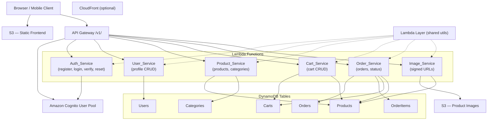

# Design Document: ShopEase E-Commerce Platform

## Overview

ShopEase is a serverless e-commerce platform built entirely on AWS managed services. It supports two user roles — Customer and Admin — and covers the full shopping lifecycle: registration, authentication, product browsing, cart management, order placement, and fulfillment tracking.

The platform is designed for operational simplicity (no servers to manage), cost efficiency (pay-per-request), and horizontal scalability. All infrastructure is defined as code (AWS SAM or CDK) and deployable with a single command.

### Key Design Principles

- Serverless-first: Lambda + API Gateway + DynamoDB + S3 + Cognito
- Least-privilege IAM: each Lambda has its own role scoped to only what it needs
- Shared utilities via Lambda Layer to avoid code duplication
- Atomic operations via DynamoDB transactions for order placement
- Signed URLs for secure, time-limited image access

---

## Architecture



### Request Flow

1. Client sends HTTP request to API Gateway `/v1/` endpoint
2. API Gateway validates the JWT via Cognito Authorizer (for protected routes)
3. API Gateway performs JSON Schema request body validation (POST/PUT)
4. API Gateway invokes the target Lambda function with request context (including Cognito group)
5. Lambda uses shared Layer utilities for validation, DynamoDB access, and response formatting
6. Lambda returns a structured JSON response; API Gateway forwards it to the client

---

## Components and Interfaces

### Auth_Service

Handles all Cognito interactions. Wraps Cognito SDK calls and maps Cognito errors to HTTP responses.

| Operation | Method | Path | Auth |
|---|---|---|---|
| Register | POST | /v1/auth/register | None |
| Verify Email | POST | /v1/auth/verify | None |
| Resend Verification | POST | /v1/auth/resend-verification | None |
| Login | POST | /v1/auth/login | None |
| Forgot Password | POST | /v1/auth/forgot-password | None |
| Confirm Password Reset | POST | /v1/auth/confirm-password | None |

A Cognito Post-Confirmation trigger Lambda invokes User_Service logic to create the DynamoDB profile record when a user confirms their email.

### User_Service

Manages user profile records in DynamoDB. Extracts `userId` from the JWT claims passed by API Gateway.

| Operation | Method | Path | Auth |
|---|---|---|---|
| Get Profile | GET | /v1/users/me | Customer |
| Update Profile | PUT | /v1/users/me | Customer |

### Product_Service

Manages the product catalog and categories.

| Operation | Method | Path | Auth |
|---|---|---|---|
| List Products | GET | /v1/products | None |
| Get Product | GET | /v1/products/{productId} | None |
| Create Product | POST | /v1/products | Admin |
| Update Product | PUT | /v1/products/{productId} | Admin |
| Delete Product | DELETE | /v1/products/{productId} | Admin |
| List Categories | GET | /v1/categories | None |
| Create Category | POST | /v1/categories | Admin |
| Delete Category | DELETE | /v1/categories/{categoryId} | Admin |

### Cart_Service

Manages per-customer shopping carts. All operations require Customer auth; `userId` is extracted from JWT.

| Operation | Method | Path | Auth |
|---|---|---|---|
| Get Cart | GET | /v1/cart | Customer |
| Add/Update Item | POST | /v1/cart/items | Customer |
| Update Item Quantity | PUT | /v1/cart/items/{productId} | Customer |
| Remove Item | DELETE | /v1/cart/items/{productId} | Customer |

### Order_Service

Handles order placement and lifecycle. Uses DynamoDB transactions for atomic order creation.

| Operation | Method | Path | Auth |
|---|---|---|---|
| Place Order | POST | /v1/orders | Customer |
| Get Order History | GET | /v1/orders | Customer |
| Get Order Detail | GET | /v1/orders/{orderId} | Customer |
| Update Order Status | PUT | /v1/orders/{orderId}/status | Admin |
| List All Orders (Admin) | GET | /v1/admin/orders | Admin |

### Image_Service

Generates pre-signed S3 URLs for product image uploads.

| Operation | Method | Path | Auth |
|---|---|---|---|
| Get Signed URLs | POST | /v1/products/{productId}/images/upload-urls | Admin |

### Lambda Layer (shared utilities)

Packaged as a single Lambda Layer consumed by all functions:

- `response.js` — standard JSON response builder with error envelope `{ "error": "<message>" }`
- `validate.js` — input validation helpers (E.164 phone, price range, required fields)
- `dynamo.js` — DynamoDB DocumentClient singleton with retry logic
- `auth.js` — JWT claim extraction (userId, groups) from API Gateway request context
- `errors.js` — typed error classes mapping to HTTP status codes

### API Gateway

- Base path: `/v1/`
- Cognito Authorizer attached to all routes except: register, login, verify, resend-verification, forgot-password, confirm-password, GET /v1/products, GET /v1/products/{productId}, GET /v1/categories
- JSON Schema request models on all POST/PUT endpoints
- Gateway responses configured for consistent `{ "error": "<message>" }` envelope on 4xx/5xx
- CORS enabled on all endpoints

---

## Data Models

### Users Table

| Attribute | Type | Notes |
|---|---|---|
| userId | String (PK) | Cognito sub |
| name | String | |
| email | String | |
| phoneNumber | String | E.164 format |
| address | Map | `{ street, city, state, postalCode, country }` |
| createdAt | String | ISO 8601 |
| updatedAt | String | ISO 8601 |

### Products Table

| Attribute | Type | Notes |
|---|---|---|
| productId | String (PK) | UUID |
| name | String | |
| description | String | |
| price | Number | Decimal, > 0 |
| stockQuantity | Number | Integer, >= 0 |
| categoryId | String | FK → Categories |
| imageKeys | List\<String\> | S3 object keys |
| isActive | Boolean | false = soft deleted |
| createdAt | String | ISO 8601 |
| updatedAt | String | ISO 8601 |

GSI: `CategoryIndex` — PK: `categoryId`, SK: `createdAt`

### Categories Table

| Attribute | Type | Notes |
|---|---|---|
| categoryId | String (PK) | UUID |
| name | String | |
| isActive | Boolean | |
| createdAt | String | ISO 8601 |

### Carts Table

| Attribute | Type | Notes |
|---|---|---|
| userId | String (PK) | |
| productId | String (SK) | |
| quantity | Number | Integer, > 0 |
| addedAt | String | ISO 8601 |

### Orders Table

| Attribute | Type | Notes |
|---|---|---|
| orderId | String (PK) | UUID |
| userId | String | |
| status | String | Pending \| Processing \| Shipped \| Delivered |
| totalAmount | Number | |
| deliveryAddress | Map | Snapshot from user profile at order time |
| createdAt | String | ISO 8601 |
| updatedAt | String | ISO 8601 |

GSI: `UserOrdersIndex` — PK: `userId`, SK: `createdAt`
GSI: `StatusIndex` — PK: `status`, SK: `createdAt`

### OrderItems Table

| Attribute | Type | Notes |
|---|---|---|
| orderId | String (PK) | |
| productId | String (SK) | |
| productName | String | Snapshot at order time |
| unitPrice | Number | Snapshot at order time |
| quantity | Number | |
| lineTotal | Number | unitPrice × quantity |

### Valid Order Status Transitions

```
Pending → Processing → Shipped → Delivered
```

Only sequential forward transitions are permitted. No skipping, no reversal.

---

## Correctness Properties

*A property is a characteristic or behavior that should hold true across all valid executions of a system — essentially, a formal statement about what the system should do. Properties serve as the bridge between human-readable specifications and machine-verifiable correctness guarantees.*

### Property 1: Registration creates DynamoDB profile

*For any* valid registration payload (email, password, name, phone number), after successful Cognito user creation, a corresponding user profile record with matching fields must exist in the DynamoDB Users table.

**Validates: Requirements 1.2**

---

### Property 2: Duplicate email registration is rejected

*For any* email address already associated with an existing Cognito account, submitting a registration request with that email must return HTTP 409.

**Validates: Requirements 1.4**

---

### Property 3: Invalid password is rejected at registration

*For any* password that violates the policy (fewer than 8 characters, missing uppercase, missing digit, or missing special character), a registration request must return HTTP 400.

**Validates: Requirements 1.5**

---

### Property 4: Missing required registration fields are rejected

*For any* registration request missing one or more required fields (email, password, name, phone number), the response must be HTTP 400 identifying the missing fields.

**Validates: Requirements 1.6**

---

### Property 5: Email verification confirms account

*For any* user with a pending verification code, submitting the correct code must result in the Cognito account being marked as confirmed.

**Validates: Requirements 2.1**

---

### Property 6: Invalid verification code is rejected

*For any* incorrect or expired verification code, the response must be HTTP 400.

**Validates: Requirements 2.2**

---

### Property 7: Valid login returns JWT tokens

*For any* confirmed user with valid credentials, the login response must include a Cognito-issued access token, ID token, and refresh token.

**Validates: Requirements 3.1**

---

### Property 8: Invalid credentials are rejected

*For any* credential pair where the password does not match the stored Cognito password for the given email, the response must be HTTP 401.

**Validates: Requirements 3.2**

---

### Property 9: Unverified account login is rejected

*For any* user whose Cognito account is not yet confirmed, a login attempt must return HTTP 403.

**Validates: Requirements 3.3**

---

### Property 10: Password reset round-trip

*For any* user with a valid password reset code and a new policy-compliant password, confirming the reset must result in the user being able to log in with the new password.

**Validates: Requirements 4.2**

---

### Property 11: Invalid reset code is rejected

*For any* invalid or expired password reset confirmation code, the response must be HTTP 400.

**Validates: Requirements 4.3**

---

### Property 12: User profile CRUD round-trip

*For any* authenticated customer, reading the profile must return the values currently stored in DynamoDB; and for any valid update payload, after a PUT request the stored DynamoDB record and the response body must both reflect the updated values.

**Validates: Requirements 5.1, 5.2**

---

### Property 13: Invalid profile update is rejected

*For any* profile update request containing an invalid field value (e.g., phone number not in E.164 format), the response must be HTTP 400.

**Validates: Requirements 5.3**

---

### Property 14: Profile access is isolated per user

*For any* two distinct authenticated customers A and B, customer A must receive HTTP 403 when attempting to read or modify customer B's profile.

**Validates: Requirements 5.4**

---

### Property 15: Customer cannot invoke Admin-only operations

*For any* authenticated Customer JWT and any Admin-only endpoint (create/update/delete product, update order status), the response must be HTTP 403.

**Validates: Requirements 6.3**

---

### Property 16: Product creation round-trip

*For any* valid product payload submitted by an Admin, the response must be HTTP 201 with a generated productId, and a DynamoDB record with matching fields must exist and be retrievable via the product detail endpoint.

**Validates: Requirements 7.1**

---

### Property 17: Product update round-trip

*For any* existing product and valid update payload submitted by an Admin, the DynamoDB record and the response body must both reflect the updated field values.

**Validates: Requirements 7.2**

---

### Property 18: Soft-deleted product is excluded from active listings

*For any* product that has been deleted by an Admin, that product must have `isActive = false` in DynamoDB and must not appear in any product listing or search result.

**Validates: Requirements 7.3**

---

### Property 19: Invalid product payload is rejected

*For any* product creation or update request with invalid data (negative price, non-numeric stock, missing required fields), the response must be HTTP 400.

**Validates: Requirements 7.4**

---

### Property 20: Non-existent product update/delete returns 404

*For any* productId not present in DynamoDB, an Admin update or delete request must return HTTP 404.

**Validates: Requirements 7.5**

---

### Property 21: Signed URL generation correctness

*For any* existing product ID and list of image filenames, the Image_Service must return one signed URL per filename, and each URL's expiry must be no more than 900 seconds (15 minutes) from the time of generation.

**Validates: Requirements 8.1, 8.2**

---

### Property 22: Signed URL request for non-existent product returns 404

*For any* productId not present in DynamoDB, a signed URL request must return HTTP 404.

**Validates: Requirements 8.5**

---

### Property 23: Product listing returns only active products

*For any* state of the Products table, the product listing endpoint must return only products where `isActive = true`.

**Validates: Requirements 9.1**

---

### Property 24: Pagination correctness

*For any* product dataset and pageSize value, the number of items in each page must not exceed pageSize; a `nextToken` must be present in the response if and only if there are additional results beyond the current page.

**Validates: Requirements 9.2, 9.3, 9.4**

---

### Property 25: Search filter returns matching active products

*For any* search term, all returned products must be active and must have the search term present (case-insensitive) in their name or category name; no matching active product must be omitted.

**Validates: Requirements 10.1**

---

### Property 26: Category filter returns only products in that category

*For any* categoryId filter, all returned products must be active and must have `categoryId` equal to the filter value.

**Validates: Requirements 10.2**

---

### Property 27: Price range filter returns only products within range

*For any* minPrice and/or maxPrice filter, all returned products must be active and must have price >= minPrice (if provided) and <= maxPrice (if provided).

**Validates: Requirements 10.3**

---

### Property 28: Combined filters apply as AND condition

*For any* combination of search, categoryId, minPrice, and maxPrice filters, the returned products must satisfy all provided filter conditions simultaneously.

**Validates: Requirements 10.4**

---

### Property 29: Invalid price filter is rejected

*For any* minPrice or maxPrice value that is non-numeric or negative, the response must be HTTP 400.

**Validates: Requirements 10.5**

---

### Property 30: Product detail round-trip

*For any* existing active product, the product detail endpoint must return all fields: name, description, price, stock quantity, category, and all image keys.

**Validates: Requirements 11.1**

---

### Property 31: Inactive or non-existent product detail returns 404

*For any* productId that does not exist or has `isActive = false`, the product detail endpoint must return HTTP 404.

**Validates: Requirements 11.2**

---

### Property 32: Category creation round-trip

*For any* valid category name submitted by an Admin, the response must be HTTP 201 with a generated categoryId, and the category must appear in the active categories listing.

**Validates: Requirements 12.1**

---

### Property 33: Category listing returns only active categories

*For any* state of the Categories table, the categories endpoint must return only categories where `isActive = true`.

**Validates: Requirements 12.2**

---

### Property 34: Category with active products cannot be deleted

*For any* category that has at least one active product assigned to it, an Admin delete request must return HTTP 409.

**Validates: Requirements 12.4**

---

### Property 35: Cart add/increment round-trip

*For any* authenticated customer and valid product with sufficient stock, after adding the product to the cart the cart must contain that item; if the item was already present, the quantity must be the sum of the previous quantity and the added quantity.

**Validates: Requirements 13.1**

---

### Property 36: Cart quantity update round-trip

*For any* existing cart item and valid positive quantity, after a PUT update the cart item's quantity must equal the new value.

**Validates: Requirements 13.2**

---

### Property 37: Adding non-existent or inactive product to cart returns 404

*For any* productId that does not exist or is inactive, an add-to-cart request must return HTTP 404.

**Validates: Requirements 13.3**

---

### Property 38: Over-stock cart addition is rejected

*For any* product and quantity where quantity > product.stockQuantity, an add-to-cart or update request must return HTTP 409.

**Validates: Requirements 13.4**

---

### Property 39: Zero or negative quantity removes cart item

*For any* existing cart item, submitting a PUT update with quantity <= 0 must result in the item being removed from the cart.

**Validates: Requirements 13.5**

---

### Property 40: Cart totals are computed correctly

*For any* cart state, the GET cart response must include each item's line total (unit price × quantity) and the grand total must equal the sum of all line totals.

**Validates: Requirements 14.1**

---

### Property 41: Cart item deletion round-trip

*For any* existing cart item, after a DELETE request that item must no longer appear in the cart.

**Validates: Requirements 14.2**

---

### Property 42: Cart access is isolated per user

*For any* two distinct authenticated customers A and B, customer A must receive HTTP 403 when attempting to view or modify customer B's cart.

**Validates: Requirements 14.3**

---

### Property 43: Order placement atomicity and correctness

*For any* customer cart where all items have sufficient stock, placing an order must result in: an order record created with status `Pending`, stock quantities decremented by the ordered amounts, the customer's cart cleared, and the delivery address matching the customer's profile address at order time.

**Validates: Requirements 15.1, 15.5**

---

### Property 44: Insufficient stock prevents order placement

*For any* cart where at least one item's requested quantity exceeds available stock, placing an order must return HTTP 409 and must not modify any stock quantities, order records, or cart state.

**Validates: Requirements 15.3**

---

### Property 45: Order history is isolated per customer

*For any* authenticated customer, the order history endpoint must return only orders belonging to that customer, and must return HTTP 403 if another customer's orders are requested.

**Validates: Requirements 16.1, 16.3**

---

### Property 46: Order detail round-trip

*For any* existing order belonging to the requesting customer, the order detail endpoint must return all fields: items, quantities, unit prices, total amount, delivery address, and current status.

**Validates: Requirements 16.2**

---

### Property 47: Order status state machine

*For any* order and proposed new status, the update must succeed only for the valid sequential transitions (Pending→Processing, Processing→Shipped, Shipped→Delivered); all other transitions must return HTTP 400.

**Validates: Requirements 17.2, 17.3**

---

### Property 48: Non-existent order status update returns 404

*For any* orderId not present in DynamoDB, an Admin status update request must return HTTP 404.

**Validates: Requirements 17.4**

---

### Property 49: Admin order listing respects status filter

*For any* status filter value applied to the admin orders endpoint, all returned orders must have `status` equal to the filter value.

**Validates: Requirements 17.5**

---

## Error Handling

### Error Response Envelope

All 4xx and 5xx responses use a consistent JSON envelope:

```json
{ "error": "<descriptive message>" }
```

This is enforced at two levels:
1. API Gateway gateway responses (for auth failures, validation failures before Lambda invocation)
2. Lambda Layer `response.js` utility (for application-level errors)

### HTTP Status Code Mapping

| Scenario | Status |
|---|---|
| Missing/invalid request fields | 400 |
| Authentication failure (bad credentials) | 401 |
| Unverified account | 403 |
| Insufficient permissions (wrong role) | 403 |
| Resource not found | 404 |
| Conflict (duplicate, insufficient stock, category in use) | 409 |
| Unhandled Lambda exception | 500 |

### Lambda Error Handling Pattern

Each Lambda function wraps its handler in a try/catch:

```javascript
exports.handler = async (event) => {
  try {
    // business logic
  } catch (err) {
    if (err instanceof AppError) {
      return response.error(err.statusCode, err.message);
    }
    console.error('Unhandled error:', err);
    return response.error(500, 'Internal server error');
  }
};
```

The Lambda Layer `errors.js` defines typed error classes:

```javascript
class NotFoundError extends AppError { constructor(msg) { super(404, msg); } }
class ConflictError extends AppError { constructor(msg) { super(409, msg); } }
class ForbiddenError extends AppError { constructor(msg) { super(403, msg); } }
class ValidationError extends AppError { constructor(msg) { super(400, msg); } }
```

### DynamoDB Transaction Failures

Order placement uses `TransactWriteItems`. If the transaction fails due to a `TransactionCanceledException` with a `ConditionalCheckFailed` reason on a stock item, the Order_Service returns HTTP 409 identifying the out-of-stock products. No partial state is written.

### Cognito Error Mapping

| Cognito Exception | HTTP Response |
|---|---|
| UsernameExistsException | 409 |
| InvalidPasswordException | 400 |
| CodeMismatchException | 400 |
| ExpiredCodeException | 400 |
| NotAuthorizedException | 401 |
| UserNotConfirmedException | 403 |
| UserNotFoundException | 200 (password reset, to prevent enumeration) |

---

## Testing Strategy

### Dual Testing Approach

Both unit tests and property-based tests are required. They are complementary:

- Unit tests catch concrete bugs with specific inputs and verify integration points
- Property-based tests verify universal correctness across randomized inputs

### Property-Based Testing

**Library**: [fast-check](https://github.com/dubzzz/fast-check) (JavaScript/TypeScript)

Each correctness property defined above must be implemented as a single property-based test using fast-check's `fc.assert(fc.property(...))`. Tests must be configured to run a minimum of 100 iterations.

Each test must be tagged with a comment referencing the design property:

```javascript
// Feature: shopease-ecommerce, Property 35: Cart add/increment round-trip
test('cart add increments quantity correctly', () => {
  fc.assert(
    fc.property(
      fc.record({ productId: fc.uuid(), quantity: fc.integer({ min: 1, max: 99 }) }),
      (item) => {
        // arrange, act, assert
      }
    ),
    { numRuns: 100 }
  );
});
```

### Unit Tests

Unit tests focus on:

- Specific examples demonstrating correct behavior (e.g., exact error message content)
- Integration points between Lambda functions and DynamoDB/Cognito (using mocks)
- Edge cases: empty cart order attempt, zero-quantity cart update, password reset for non-existent email
- Cognito error mapping (each exception type maps to the correct HTTP status)

Avoid writing unit tests that duplicate what property tests already cover. Unit tests should be reserved for cases where a specific concrete example adds value beyond what randomized testing provides.

### Test Organization

```
tests/
  unit/
    auth/         # Auth_Service Lambda handlers
    users/        # User_Service Lambda handlers
    products/     # Product_Service Lambda handlers
    cart/         # Cart_Service Lambda handlers
    orders/       # Order_Service Lambda handlers
    images/       # Image_Service Lambda handlers
    layer/        # Shared Lambda Layer utilities
  property/
    auth.property.test.js
    users.property.test.js
    products.property.test.js
    cart.property.test.js
    orders.property.test.js
    images.property.test.js
  integration/    # End-to-end tests against deployed stack (optional)
```

### Coverage Targets

- Unit tests: 80% line coverage on Lambda handler code
- Property tests: one test per correctness property (Properties 1–49)
- All error conditions in the Cognito error mapping table must have a unit test
